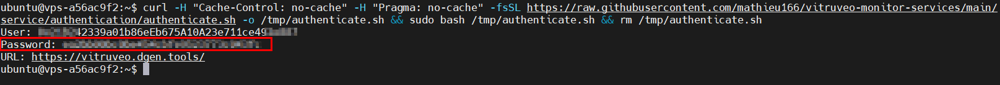

# Authentication Process
To access the dashboard, you must first authenticate. There are two ways to do this:

## Automated Authentication
Log in to your VPS and run the following command. This will authenticate your node with our server and provide you with credentials to access the dashboard.
```shell
curl -H "Cache-Control: no-cache" -H "Pragma: no-cache" -fsSL https://raw.githubusercontent.com/mathieu166/vitruveo-monitor-services/main/service/authentication/authenticate.sh -o /tmp/authenticate.sh && sudo bash /tmp/authenticate.sh && rm /tmp/authenticate.sh
```
Here’s what it should look like after running the command above. Your node's public address will appear as the username, with the password displayed just below it.



### BE AWARE
When using this method, it sets up a secure connection with our backend server using a local Geth instance. To authenticate your identity and ensure the integrity of the data exchanged, the agent generates a unique message and signs it using your validator public address, which is accessible through your unlocked Geth instance. This signature serves as a secure identifier, allowing us to verify the authenticity of the messages and ensure that they come from a trusted source.

## Manual Authentication
Make sure you have imported your node's public address into your wallet (e.g., Metamask, Rabby) before proceeding.

1. Visit https://etherscan.io/verifiedSignatures
2. Click on Sign Message on the top right of the screen
3. Connect your wallet if you haven't already
4. Ensure the selected address is your node's public address
5. Enter 'vitruveo' in the Message field
6. On the next screen, copy the Signature Hash from the bottom section
7. Once completed, please notify MatroxDev on Discord, and you'll receive the password to access the dashboard.
